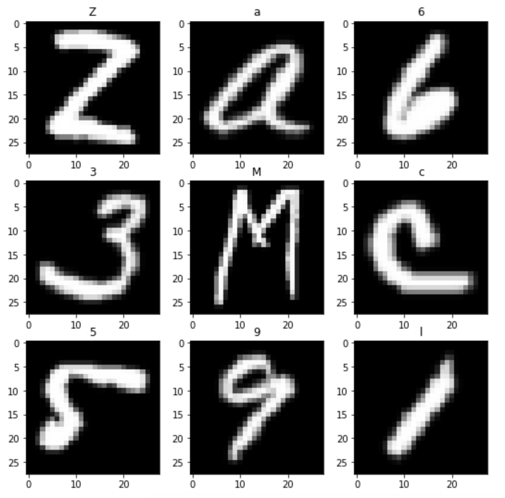
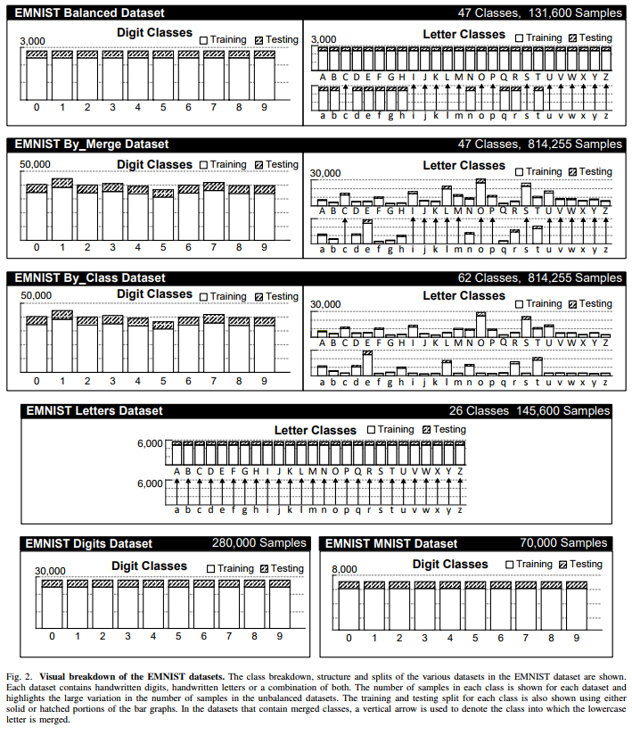
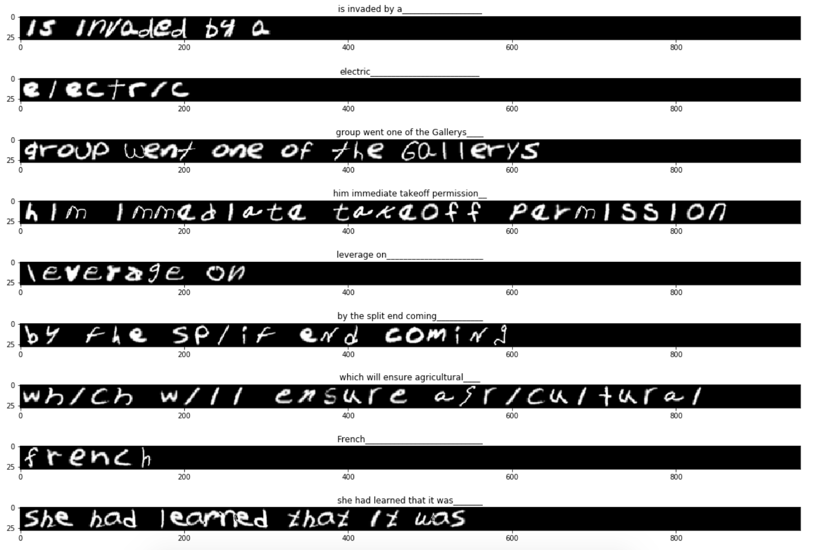
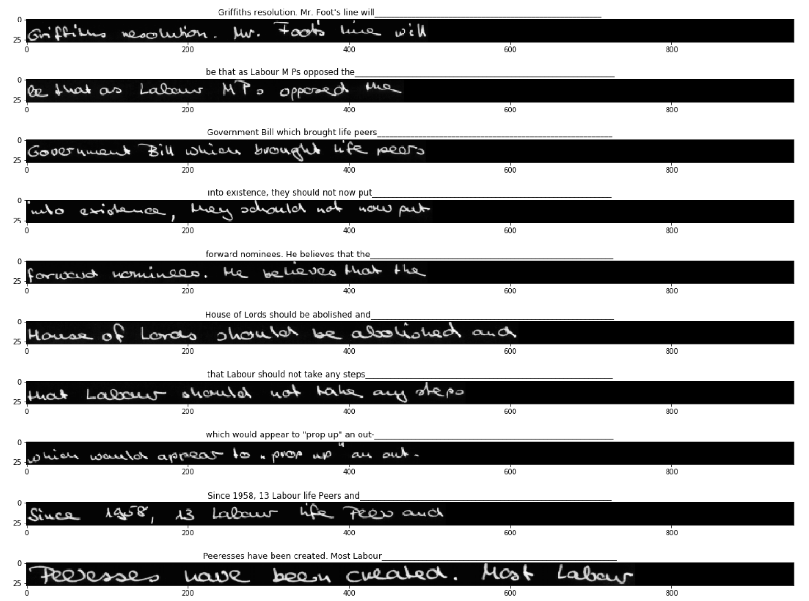
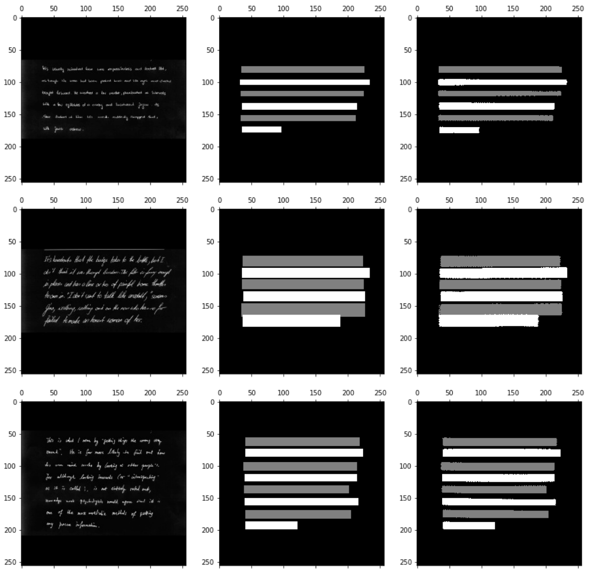
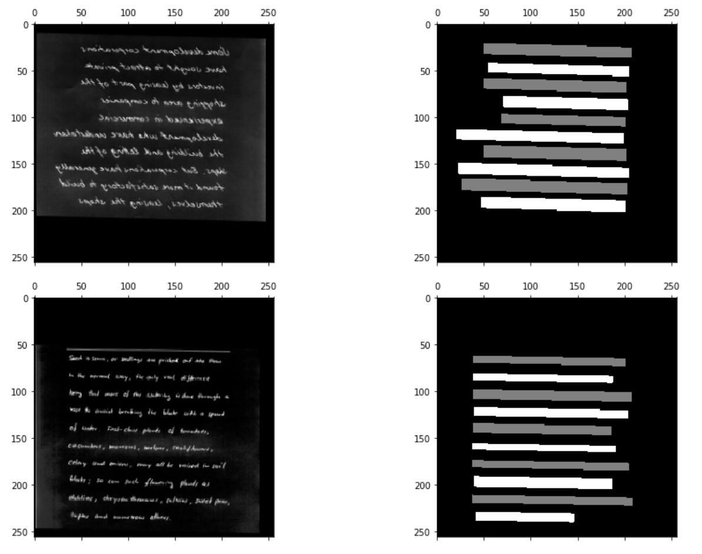
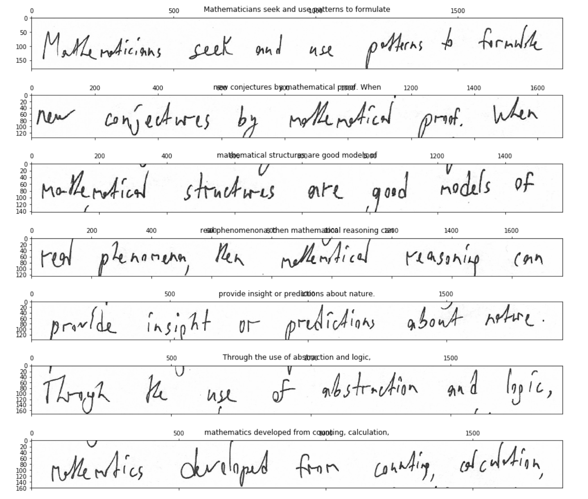

# Text Recognizer Pro

> Deploy a computer vision and natural language processing system into production.

<p align="center">
  <a href="http://makeapullrequest.com">
    
  </a>
  <a href="https://github.com/Zhenye-Na/text-recognizer-pro/issues">
    
  </a>
  <a href="http://hits.dwyl.io/Zhenye-Na/text-recognizer-pro">
    
  </a>
  <a href="https://github.com/ellerbrock/open-source-badge/">
    
  </a>
</p>

<div align="center">
  
  <p>High level architecture of the Full Stack Deep Learning project. Image Source: Pieter Abbeel, Sergey Karayev, Josh Tobin. <a href="https://fullstackdeeplearning.com/march2019">Spring 2019 Full Stack Deep Learning Bootcamp</a></p>
</div><br>


<!-- START doctoc generated TOC please keep comment here to allow auto update -->
<!-- DON'T EDIT THIS SECTION, INSTEAD RE-RUN doctoc TO UPDATE -->
**Table of Contents**  *generated with [DocToc](https://github.com/thlorenz/doctoc)*

- [Project structure](#project-structure)
- [Set up](#set-up)
- [Dataset](#dataset)
  - [EMNIST dataset](#emnist-dataset)
  - [EMNIST Lines dataset](#emnist-lines-dataset)
  - [IAM Lines dataset](#iam-lines-dataset)
- [Usage](#usage)
  - [EMNIST dataset](#emnist-dataset-1)
    - [Networks and training code](#networks-and-training-code)
    - [Train MLP and CNN](#train-mlp-and-cnn)
    - [Testing](#testing)
  - [EMNIST Lines dataset](#emnist-lines-dataset-1)
    - [Train LSTM model with CTC loss](#train-lstm-model-with-ctc-loss)
  - [IAM Lines Dataset](#iam-lines-dataset)
    - [Training](#training)
- [Line Detection](#line-detection)
  - [Training data augmentation](#training-data-augmentation)
  - [Network description](#network-description)
  - [Review results](#review-results)
    - [Training result](#training-result)
    - [Testing result](#testing-result)
  - [Combining the two models](#combining-the-two-models)
- [Data Labeling and Versioning](#data-labeling-and-versioning)
  - [Export data and update metadata file](#export-data-and-update-metadata-file)
  - [Download images](#download-images)
  - [Looking at the data](#looking-at-the-data)
  - [Training on the new dataset](#training-on-the-new-dataset)
- [Web Deployment](#web-deployment)
  - [Serving predictions from a web server](#serving-predictions-from-a-web-server)
  - [Adding web server tests](#adding-web-server-tests)
- [Running web server in Docker](#running-web-server-in-docker)
- [Different setttings to try](#different-setttings-to-try)
- [References](#references)

<!-- END doctoc generated TOC please keep comment here to allow auto update -->


## Project structure

Web backend

```
api/                                     # Code for serving predictions as a REST API.
    tests/test_app.py                    # Test that predictions are working
    Dockerfile                           # Specificies Docker image that runs the web server.
    __init__.py
    app.py                               # Flask web server that serves predictions.
    serverless.yml                       # Specifies AWS Lambda deployment of the REST API.
```

Data (not under version control - one level up in the heirarchy)

```
data/                                    # Training data lives here
    raw/
        emnist/metadata.toml             # Specifications for downloading data
```

Experimentation

```
evaluation/                             # Scripts for evaluating model on eval set.
    evaluate_character_predictor.py
    evaluate_line_predictor.py

notebooks/                              # For snapshots of initial exploration, before solidfying code as proper Python files.
    01-look-at-emnist.ipynb
    02-look-at-emnist-lines.ipynb
    03-look-at-iam-lines.ipynb
    04-look-at-iam-paragraphs.ipynb
    04b-look-at-line-detector-predictions.ipynb
    05-look-at-fsdl-handwriting.ipynb
```

Convenience scripts


```
tasks/
    # Deployment
    build_api_docker.sh
    deploy_api_to_lambda.sh

    # Code quality
    lint.sh

    # Tests
    run_prediction_tests.sh
    run_validation_tests.sh
    test_api.sh

    # Training
    train_character_predictor.sh
    train_cnn_line_predictor.sh
    train_line_detector.sh
    train_lstm_line_predictor.sh
    train_lstm_line_predictor_on_iam.sh
    
    # Update metadata
    update_fsdl_paragraphs_metadata.sh
```

Main model

```
text_recognizer/                        # Package that can be deployed as a self-contained prediction system
    __init__.py

    character_predictor.py              # Takes a raw image and obtains a prediction
    line_predictor.py
    paragraph_text_recognizer.py

    datasets/                           # Code for loading datasets
        __init__.py
        dataset.py                      # Base class for datasets - logic for downloading data
        dataset_sequence.py
        emnist_dataset.py
        emnist_essentials.json
        emnist_lines_dataset.py
        fsdl_handwriting_dataset.py
        iam_dataset.py
        iam_lines_dataset.py
        iam_paragraphs_dataset.py
        sentence_generator.py


    models/                             # Code for instantiating models, including data preprocessing and loss functions
        __init__.py
        base.py                         # Base class for models
        character_model.py
        line_detector_model.py
        line_model.py
        line_model_ctc.py

    networks/                           # Code for building neural networks (i.e., 'dumb' input->output mappings) used by models
        __init__.py
        ctc.py
        fcn.py
        lenet.py
        line_cnn_all_conv.py
        line_lstm_ctc.py
        misc.py
        mlp.py

    tests/
        support/                        # Raw data used by tests
            create_emnist_lines_support_files.py
            create_emnist_support_files.py
            create_iam_lines_support_files.py
        emnist/                         # emnist sample images
        emnist_lines/                   # emnist line sample images
        iam_lines/                      # iam line sample images
        iam_paragraphs/                 # iam paragraphs sample images
        test_character_predictor.py     # Test model on a few key examples
        test_line_predictor.py
        test_paragraph_text_recognizer.py

    weights/                            # Weights for production model
        CharacterModel_EmnistDataset_mlp_weights.h5
        LineDetectorModel_IamParagraphsDataset_fcn_weights.h5
        LineModelCtc_EmnistLinesDataset_line_lstm_ctc_weights.h5
        LineModelCtc_IamLinesDataset_line_lstm_ctc_weights.h5

    util.py
```

Training

```
training/                               # Code for running training experiments and selecting the best model.
    gpu_manager.py
    gpu_util_sampler.py
    prepare_experiments.py
    run_experiment.py                   # Parse experiment config and launch training.
    update_metadata.py
    util.py                             # Logic for training a model with a given config
```


## Set up

Run

```sh
pipenv install --dev
```

From now on, precede commands with `pipenv run` to make sure they use the correct
environment.


Run

```sh
pipenv sync --dev
```

to make sure your package versions are correct.


## Dataset

### EMNIST dataset

> The EMNIST dataset is a set of handwritten character digits derived from the [NIST Special Database 19](https://www.nist.gov/srd/nist-special-database-19)  and converted to a 28x28 pixel image format and dataset structure that directly matches the [MNIST dataset](http://yann.lecun.com/exdb/mnist/) . Further information on the dataset contents and conversion process can be found in the paper available at https://arxiv.org/abs/1702.05373v1.


<div align="center">
  
  <p>EMNIST datset.</p>
</div><br>

<div align="center">
  
</div><br>


### EMNIST Lines dataset

> This is a synthetic dataset built for this project. It contains the sample sentences from Brown corpus. For each character, sample random EMNIST character and place on a line (with some random overlap).


<div align="center">
  
  <p>EMNIST Lines datset.</p>
</div><br>


### IAM Lines dataset

> The IAM Handwriting Database contains forms of handwritten English text which can be used to train and test handwritten text recognizers and to perform writer identification and verification experiments. The database contains forms of unconstrained handwritten text, which were scanned at a resolution of 300dpi and saved as PNG images with 256 gray levels. The figure below provides samples of a complete form, a text line and some extracted words.


<div align="center">
  
  <p>IAM Lines datset.</p>
</div><br>


## Usage

### EMNIST dataset

#### Networks and training code

- Look at `text_recognizer/networks/mlp.py`
- Look at `text_recognizer/networks/lenet.py`
- Look at `text_recognizer/models/base.py`
- Look at `text_recognizer/models/character_model.py`
- Look at `training/util.py`

#### Train MLP and CNN

You can run the shortcut command `tasks/train_character_predictor.sh`, which runs the following:

```
pipenv run python training/run_experiment.py --save '{"dataset": "EmnistDataset", "model": "CharacterModel", "network": "mlp",  "train_args": {"batch_size": 256}}'
```

It will take a couple of minutes to train your model.

Just for fun, you could also try a larger MLP, with a smaller batch size:

```
pipenv run python training/run_experiment.py '{"dataset": "EmnistDataset", "model": "CharacterModel", "network": "mlp", "network_args": {"num_layers": 8}, "train_args": {"batch_size": 128}}'
```

Let's also train a CNN on the same task.

```
pipenv run python training/run_experiment.py '{"dataset": "EmnistDataset", "model": "CharacterModel", "network": "lenet", "train_args": {"epochs": 1}}'
```

Training the single epoch will take about 2 minutes (that's why we only do one epoch in this lab :)). Leave it running while we go on to the next part.

It is very useful to be able to subsample the dataset for quick experiments. This is possibe by passing `subsample_fraction=0.1` (or some other fraction) at dataset initialization, or in `dataset_args` in the `run_experiment.py`dictionary, for example:

```
pipenv run python training/run_experiment.py '{"dataset": "EmnistDataset", "dataset_args": {"subsample_fraction": 0.1}, "model": "CharacterModel", "network": "mlp"}'
```

#### Testing

First, let's take a look at how the test works at

```
text_recognizer/tests/test_character_predictor.py
```

Now let's see if it works by running:

```
pipenv run pytest -s text_recognizer/tests/test_character_predictor.py
```

Or, use the shorthand `tasks/run_prediction_tests.sh`

Testing should finish quickly.


### EMNIST Lines dataset

#### Train LSTM model with CTC loss

Let's train an LSTM model with CTC loss.

```
pipenv run python training/run_experiment.py --save '{"train_args": {"epochs": 16}, "dataset": "EmnistLinesDataset", "model": "LineModelCtc", "network": "line_lstm_ctc"}'
```

or the shortcut `tasks/train_lstm_line_predictor.sh`


### IAM Lines Dataset

#### Training

Let's train with the default params by running `tasks/train_lstm_line_predictor_on_iam.sh`, which runs the follwing command:

```
pipenv run python training/run_experiment.py --save '{"dataset": "IamLinesDataset", "model": "LineModelCtc", "network": "line_lstm_ctc"}'
```

This uses our LSTM with CTC model. 8 epochs gets accuracy of 40% and takes about 10 minutes.

Training longer will keep improving: the same settings get to 60% accuracy in 40 epochs.


## Line Detection

Our approach will be to train a model that, when given an image containing lines of text, returns a pixelwise labeling of that image, with each pixel belonging to either background, odd line of handwriting, or even line of handwriting. Given the output of the model, we can find line regions with an easy image processing operation.

We are starting from the IAM dataset, which includes not only lines but the original writing sample forms, with each line and word region annotated.

Let's load the IAM dataset and then look at the data files. Run `pipenv run python text_recognizer/datasets/iam_dataset.py` Let's look at the raw data files, which are in `./data/raw/iam/iamdb/forms`.

We want to crop out the region of each page corresponding to the handwritten paragraph as our model input, and generate corresponding ground truth.

Code to do this is in `text_recognizer/datasets/iam_paragraphs_dataset.py`

We can look at the results in `notebooks/04-look-at-iam-paragraphs.ipynb` and by looking at some debug images we output in `data/interim/iam_paragraphs`.

### Training data augmentation

The model code for our new `LineDetector` is in `text_recognizer/models/line_detector_model.py`.

Because we only have about a thousand images to learn this task on, data augmentation will be crucial. Image augmentations such as streching, slight rotations, offsets, contrast and brightness changes, and potentially even mirror-flipping are tedious to code, and most frameworks provide optimized utility code for the task.

We use Keras's `ImageDataGenerator`, and you can see the parameters for it in `text_recognizer/models/line_detector_model.py`. We can take a look at what the data transformations look like in the same notebook.


### Network description

The network used in this model is `text_recognizer/networks/fcn.py`.

The basic idea is a deep convolutional network with resnet-style blocks (input to block is concatenated to block output). We call it FCN, as in "Fully Convolutional Network," after the seminal paper that first used convnets for segmentation.

Unlike the original FCN, however, we do not maxpool or upsample, but instead rely on dilated convolutions to rapidly increase the effective receptive field. [Here](https://fomoro.com/projects/project/receptive-field-calculator) is a very calculator of the effective receptive field size of a convnet.

The crucial thing to understand is that because we are labeling odd and even lines differently, each predicted pixel must have the context of the entire image to correctly label -- otherwise, there is no way to know whether the pixel is on an odd or even line.


### Review results

The model converges to something really good.

Check out `notebooks/04b-look-at-line-detector-predictions.ipynb` to see sample predictions on the test set.

We also plot some sample training data augmentation in that notebook.

#### Training result


<div align="center">
  
  <p>IAM Lines datset.</p>
</div><br>


#### Testing result


<div align="center">
  
  <p>IAM Lines datset.</p>
</div><br>


### Combining the two models

Now we are ready to combine the new `LineDetector` model and the `LinePredictor` model that we trained yesterday.

This is done in `text_recognizer/paragraph_text_recognizer.py`, which loads both models, find line regions with one, and runs each crop through the other.

We can see that it works as expected (albeit not too accurately yet) by running `pipenv run pytest -s text_recognizer/tests/test_paragraph_text_recognizer.py`.


## Data Labeling and Versioning


### Export data and update metadata file

You have noticed the `metadata.toml` files in all of our `data/raw` directories. They contain the remote source of the data, the filename it should have when downloaded, and a SHA-256 hash of the downloaded file.

The idea is that the data file has all the information needed for our dataset. In our case, it has image URLs and all the annotations we made. From this, we can download the images, and transform the annotation data into something usable by our training scripts. The hash, combined with the state of the codebase (tracked by git), then uniquely identifies the data we're going to use to train.

We replace the current `fsdl_handwriting.json` with the one we just exported, and now need to update the metadata file, since the hash is different. SHA256 hash of any file can be computed by running `shasum -a 256 <filename>`. We can also update `metadata.toml` with a convenient script that replace the SHA-256 of the current file with the SHA-256 of the new file. There is a convenience task script defined: `tasks/update_fsdl_paragraphs_metadata.sh`.

The data file itself is checked into version control, but tracked with git-lfs, as it can get heavyweight and can change frequently as we keep adding and annotating more data. Git-lfs actually does something very similar to what we more manually do with `metadata.toml`. The reason we also use the latter is for standardization across other types of datasets, which may not have a file we want to check into even git-lfs -- for example, EMNIST and IAM, which are too large as they include the images.

### Download images

The class `IamHandwritingDataset` in `text_recognizer/datasets/iam_handwriting.py` must be able to load the data in the exported format and present it to consumers in a format they expect (e.g. `dataset.line_regions_by_id`).

Since this data export does not come with images, but only pointers to remote locations of the images, the class must also be responsible for downloading the images.

In downloading many images, it is very useful to do so in parallel. We use the `concurrent.futures.ThreadPoolExecutor`method, and use the `tqdm` package to provide a nice progress bar.

### Looking at the data

We can confirm that we loaded the data correctly by looking at line crops and their corresponding strings.

Take a look at `notebooks/05-look-at-fsdl-handwriting.ipynb`.

<div align="center">
  
</div><br>

### Training on the new dataset

We're not going to have time to train on the new dataset, but that is something that is now possible. As an exercise, you could write `FsdlHandwritingLinesDataset` and `FsdlHandwritingParagraphsDataset`, and be able to train a model on a combination of IAM and FSDL Handwriting data on both the line detection and line text prediction tasks.


## Web Deployment

### Serving predictions from a web server

First, we will get a Flask web server up and running and serving predictions.

```
pipenv run python api/app.py
```

Open up another terminal tab (click on the '+' button under 'File' to open the launcher). In this terminal, we'll send some test image to the web server we're running in the first terminal.

**Make sure to cd into the lab9 directory in this new terminal.**

```
export API_URL=http://0.0.0.0:8000
curl -X POST "${API_URL}/v1/predict" -H 'Content-Type: application/json' --data '{ "image": "data:image/png;base64,'$(base64 -w0 -i text_recognizer/tests/support/emnist_lines/or\ if\ used\ the\ results.png)'" }'
```

If you want to look at the image you just sent, you can navigate to `lab9/text_recognizer/tests/support/emnist_lines` in the file browser on the left, and open the image.

We can also send a request specifying a URL to an image:

```
curl "${API_URL}/v1/predict?image_url=http://s3-us-west-2.amazonaws.com/fsdl-public-assets/emnist_lines/or%2Bif%2Bused%2Bthe%2Bresults.png"
```


### Adding web server tests

The web server code should have a unit test just like the rest of our code.

Let's check it out: the tests are in `api/tests/test_app.py`. You can run them with

```
tasks/test_api.sh
```

## Running web server in Docker

Now, we'll build a docker image with our application. The Dockerfile in `api/Dockerfile` defines how we're building the docker image.

Still in the `lab9` directory, run:

```
tasks/build_api_docker.sh
```

This should take a couple of minutes to complete.

When it's finished, you can run the server with

```
docker run -p 8000:8000 --name api -it --rm text_recognizer_api
```

You can run the same curl commands as you did when you ran the flask server earlier, and see that you're getting the same results.

```
curl -X POST "${API_URL}/v1/predict" -H 'Content-Type: application/json' --data '{ "image": "data:image/png;base64,'$(base64 -w0 -i text_recognizer/tests/support/emnist_lines/or\ if\ used\ the\ results.png)'" }'

curl "${API_URL}/v1/predict?image_url=http://s3-us-west-2.amazonaws.com/fsdl-public-assets/emnist_lines/or%2Bif%2Bused%2Bthe%2Bresults.png"
```

If needed, you can connect to your running docker container by running:

```
docker exec -it api bash
```


## Different setttings to try

- Change sliding window width/stride
- Not using a sliding window: instead of sliding a LeNet over, you could just run the input through a few conv/pool layers, squeeze out the last (channel) dimension (which should be 0), and input the result into the LSTM. You can play around with the parameters there.
- Change number of LSTM dimensions
- Wrap the LSTM in a `Bidirectional()` wrapper, which will have two LSTMs read the input forward and backward and concatenate the outputs
- Stack a few layers of LSTMs
- Try to get an all-conv approach to work for faster training
- Add BatchNormalization
- Play around with learning rate. In order to launch experiments with different learning rates, you will have to implement something in `training/run_experiment.py` and `text_recognizer/datasets/base.py`
- Train on EmnistLines and fine-tune on IamLines. In order to do that, you might want to implement a model wrapper class that can take multiple datasets.
- Try adding more data augmentations, or mess with the parameters of the existing ones
- Try the U-Net architecture, that MaxPool's down and then UpSamples back up, with increased conv layer channel dimensions in the middle (https://lmb.informatik.uni-freiburg.de/people/ronneber/u-net/).


## References

[1] Pieter Abbeel, Sergey Karayev, Josh Tobin. [*"Spring 2019 Full Stack Deep Learning Bootcamp"*](https://fullstackdeeplearning.com/march2019).  
[2] Alex Graves, Santiago Fernandez, Faustino Gomez, Jurgen Schmidhuber. [Connectionist Temporal Classification: Labelling Unsegmented Sequence Data with Recurrent Neural Networks](https://www.cs.toronto.edu/~graves/icml_2006.pdf)  
[3] Batuhan Balci, Dan Saadati, Dan Shiferaw. [*"Handwritten Text Recognition using Deep Learning"*](http://cs231n.stanford.edu/reports/2017/pdfs/810.pdf).